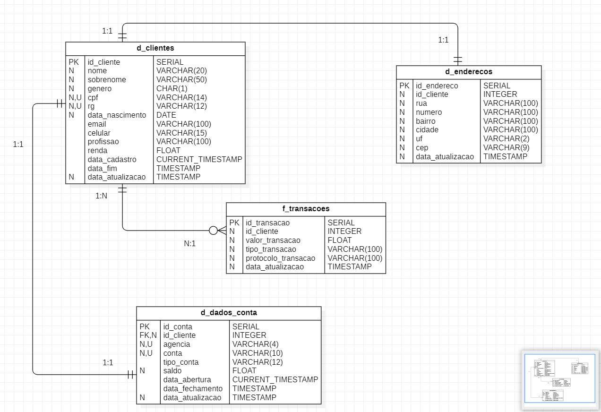
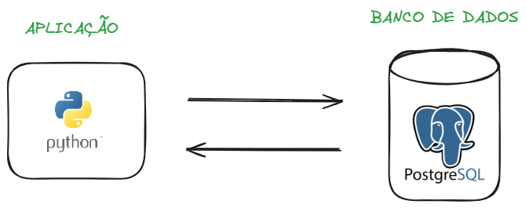

## Objetivo do Projeto

O projeto está sendo desenvolvido com o objetivo de colocar em prática o conhecimento adquirido sobre POO (programação orientada à ojetos) e mais alguns outros conceitos.

## Estrutura do Projeto

O projeto foi estruturado para receber dados de uma aplicação - inicialmente vindo do terminal - e posteriormente carregados em um banco de dados PostgreSQL. Nesse projeto foi desenvolvido um Diagrama Entidade-Relacionamento (DER) para idealizar o schema do banco de dados.

## Tecnologias utilizadas

Python:

- sqlalchemy
- datetime
- time
- pytz
- hashlib
- sys
- os
- email_validator
- re
- random
- dotenv
- psycopg2

SQL:

- create database
- create schema
- create table
